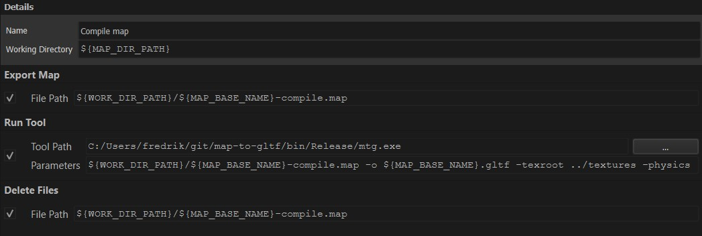

# How to use with custom game in Trenchbroom

1. Set the `Game Path` of your game in Trenchbrooms preferences to the be root of your game project.

2. Modify the `GameConfig.cfg` of you custom game to:
    * Only allow `Quake3 (Valve)` format
    * Set `[PATH]` in `"filesystem": { "searchpath": [PATH] }` to be the assets directory of your project. This is the direcotry where your `textures` folder is located.
    * Set `[NAME]` in `"textures": { "type": "directory", "root": [NAME] }` to be your `textures` folder name. Note that this is just the _name_ of the folder, not a relative or absolut path.

3. Add a compile profile in Trenchbroom.

In the following example, the map is always located in a folder called `maps` that is located in the `searchpath` described above. The texture root for `map-to-gltf/mtg` will be the textures folder, relative to the current working directory.

Note that many 3D programs (example Windows 3D Viewer) does not support OMI colliders, and will not be able to load the file if the `-physics` flag is set.

Also note that most GLTF implementations does not support relative paths for images, thus cannot load files exported with the above example. To work around this, make sure the `-texroot` is in the same directory as the output GLTF file, or use `-embed` to embed the textures in the file.